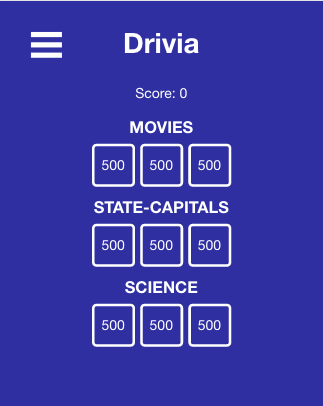
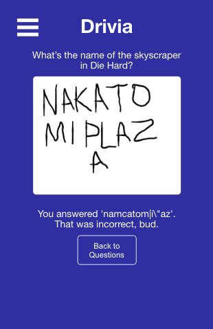
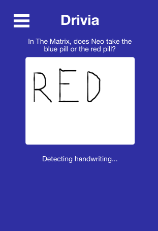

# Drivia
https://drivia.vercel.app

## API Repo
https://github.com/jordanhenn/drivia-api

## Summary
Drivia is an app where you answer in your own handwriting. User starts a quick game, selects three distinct categories, then answers nine questions (3 per category) by writing out their answers with either their mouse on their computer, or their finger on their mobile phone.

## Tech Used
HTML, CSS, Javascript, React, Tesseract OCR
